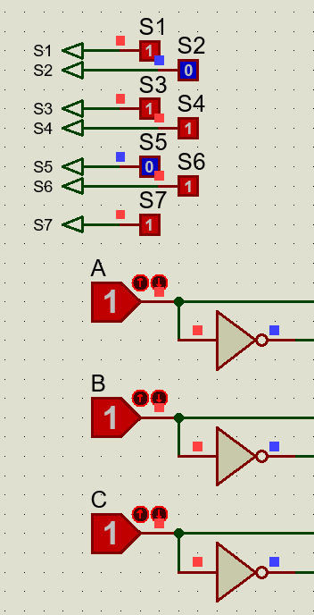

# Tugas Pendahuluan Modul 3
```
Nama    : Maxwell Zefanya Ginting
NPM     : 2306221200
```

## Perancangan (60 Poin)
  *TAHAP PERANCANGAN WAJIB DIKERJAKAN UNTUK CS*
### 1. Buatlah truth table untuk mengubah input biner 3 bit (000 - 111) dan mengubahnya ke huruf pada seven segment.  (20 Poin)

    Note : Gunakan 7 segment common cathode.

| Binary | 000 | 001 | 010 | 011 | 100 | 101 | 110 | 111 |
|--------|-----|-----|-----|-----|-----|-----|-----|-----|
| Character | r   | e   | n   | t   | d   | o   | g   | s   |


**Format Truth Table** :
| Char  | A | B | C | s1 | s2 | s3 | s4 | s5 | s6 | s7 |
|-------|---|---|---|----|----|----|----|----|----|----|
| **r** | 0 | 0 | 0 | 1  | 0  | 0  | 0  | 1  | 1  | 0  |
| **e** | 0 | 0 | 1 | 1  | 0  | 0  | 1  | 1  | 1  | 1  |
| **n** | 0 | 1 | 0 | 1  | 1  | 1  | 0  | 1  | 1  | 0  |
| **t** | 0 | 1 | 1 | 0  | 0  | 0  | 1  | 1  | 1  | 1  |
| **d** | 1 | 0 | 0 | 0  | 1  | 1  | 1  | 1  | 0  | 1  |
| **o** | 1 | 0 | 1 | 1  | 1  | 1  | 1  | 1  | 1  | 0  |
| **g** | 1 | 1 | 0 | 1  | 1  | 1  | 1  | 0  | 1  | 1  |
| **s** | 1 | 1 | 1 | 1  | 0  | 1  | 1  | 0  | 1  | 1  |  


### 2. Berdasarkan truth table tersebut, buatlah fungsi aljabar boolean yang telah disederhanakan menggunakan k-map, sertakan pula proses penyederhanaannya. (20 Poin)

    Note: Diperkenankan untuk menggunakan gerbang logika kompleks. Pembuatan K-Map dapat dikerjakan pada kertas kemudian difoto atau menggunakan tabel excel dll.

| Output | `s1` | `s2` | `s3` | `s4` |
|--------|------|------|------|------|
| Screenshot K-Map |  |  |  |  |

| Output | `s5` | `s6` | `s7` |
|--------|------|------|------|
| Screenshot K-Map |  |  |  |

```
S1 = B'C + AB + A'C'  
S2 = AB' + BC'  
S3 = A + BC'  
S4 = A + C  
S5 = A' + B'  
S6 = A' + B + C  
S7 = A'C + AC' + AB = (A⊕C) + (AB)
```


### 3. Deskripsikanlah fungsi aljabar boolean tersebut ke dalam rangkaian menggunakan aplikasi **Proteus 8.11** dan buktikan bahwa truth table dari rangkaian sudah sesuai dengan yang direncanakan. (20 Poin)
    Note : Lampirkan masing-masing screenshot dari uji coba rangkaian berdasarkan truth tabel, jangan lupa berikan **nama** dan **NPM** kalian pada rangkaian tersebut.

| Char | `r` | `e` | `n` | `t` |
|------|-----|-----|-----|-----|
| Screenshot Uji Coba |  |  |  |  |

| Char | `d` | `o` | `g` | `s` |
|------|-----|-----|-----|-----|
| Screenshot Uji Coba |  |  |  |  |


## Teori (40 Poin)
### 4. Jelaskan perbedaan data flow style dengan behavioral style! Jelaskan juga style mana yang bersifat concurrent dan mana yang sequential. (20 Poin)

Secara kegunaan, style dataflow dapat digunakan untuk merancang sebuah rangkaian concurrent, sedangkan style behavioral bisa digunakan untuk merancang sebuah rangkaian sekuensial. Oleh karena itu, style dataflow biasanya menggunakan logic gate, sedangkan behavioral belum tentu merangkai logic gate secara spesifik, tetapi bisa menggunakan statement seperti `if-else` atau `case`.  

**REFERENSI:**
- Xilinx, “Modeling concepts,” Lab Workbook, https://www.amd.com/content/dam/amd/en/documents/university/vivado-teaching/hdl-design/2013x/Nexys4/VHDL/docs-pdf/VHDL-Lab1_Vivado.pdf (accessed Sep. 15, 2024).  
- “VHDL modelling styles: Behavioral, Dataflow, structural,” Buzztech, https://buzztech.in/vhdl-modelling-styles-behavioral-dataflow-structural/ (accessed Sep. 15, 2024).  

### 5. Jelaskan apa itu sensitivity list dan wait statement pada blok process! (10 Poin)

Sensitivity list adalah sebuah list keseluruhan signal yang akan menjadi seperti suatu input pada suatu process, dimana process tersebut akan menggunakan semua signal didalam list tersebut sebagai signal yang bisa berubah secara eksternal, dan memengaruhi signal di dalam blok process yang hanya bisa berubah secara internal saja.
Wait statement adalah sebuah statement yang memberhentikan suatu proses. Proses kemudian bisa dilanjutkan kembali/tidak dilanjutkan berdasarkan statement wait yang digunakan. Statement yang bisa melanjutkan proses adalah `wait for SPECIFIC_TIME;`, `wait on SIGNAL_LIST;`, `wait until CONDITION;`. Sedangkan bila menggunakan `wait;` saja, proses tidak bisa dijalankan kembali.  

**REFERENSI:**  
- “Sensitivity list,” VHDL Online Help - Sensitivity List - vhdl.renerta.com, https://peterfab.com/ref/vhdl/vhdl_renerta/source/vhd00062.htm (accessed Sep. 15, 2024).
- “Sensitivity list,” Sigasi, https://insights.sigasi.com/manual/rules/sensitivity-list/ (accessed Sep. 15, 2024).
- “Wait statement,” VHDL-Online, https://www.vhdl-online.de/courses/system_design/vhdl_language_and_syntax/sequential_statements/wait_statement (accessed Sep. 15, 2024). 

### 6. Jelaskan tipe-tipe pesan pada report statement! (10 Poin)

Report statement adalah sebuah statement yang mengeluarkan suatu pesan. Report statement bisa memiliki 4 tipe yang diawali oleh statement `severity`, yaitu `note`, `warning`, `error`, dan `failure`. Secara default, bila statement severity tidak ada, maka report akan dianggap sebagai tipe note. Untuk semua statement severity selain failure, proses akan terus berjalan, dan untuk sisanya, severity hanya menunjukkan seberapa pentingya report tersebut.  

**REFERENSI:**  
- P. Faes, “VHDL assert and report,” Sigasi, https://insights.sigasi.com/tech/vhdl-assert-and-report/ (accessed Sep. 15, 2024).
- “Report statement,” VHDL - Report Statement, https://peterfab.com/ref/vhdl/vhdl_renerta/mobile/source/vhd00056.htm (accessed Sep. 15, 2024). 